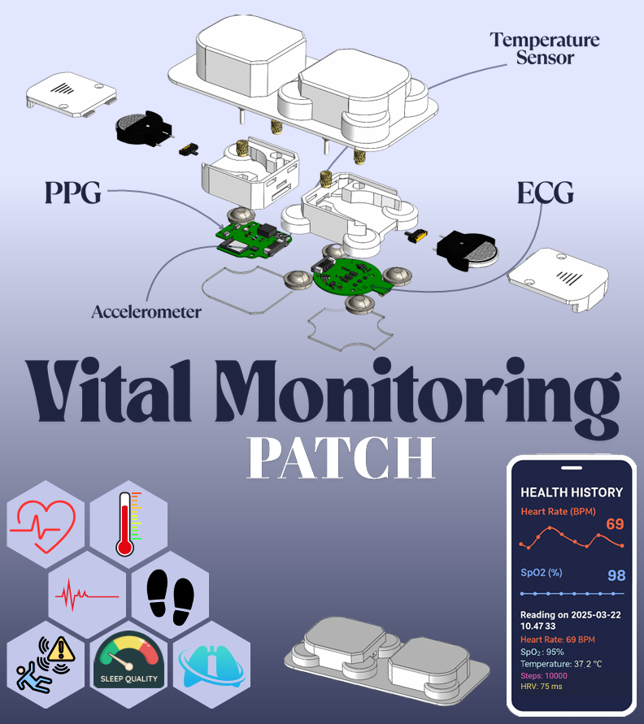

# Low-power Wireless PPG BLE Patch

This project implements a **wearable patch** for physiological signal acquisition, focusing on **Photoplethysmography (PPG)** and **Electrocardiography (ECG)** with **Bluetooth Low Energy (BLE)** connectivity.  
Built around the **ADPD1080 Analog Front-End** and **STM32WB55 MCU**, it supports low-power operation from coin cells.

---

## 🔧 Hardware Overview
- **AFE:** ADPD1080 for optical biosignal acquisition  
- **MCU:** STM32WB55 for BLE streaming and processing  
- **Power:** Coin cell + boost converter for 3.3 V  
- **PCB:** 4-layer, impedance-controlled, Altium design  

### PCB Layout


### Assembled Board


---

## 💻 Firmware Overview

The **Firmware** folder contains:
- **ADPDEvaluation and Setup** — Arduino code for ESP32 to interface with the ADPD1080 evaluation board and connect directly to a PC.  
  - Uses `ADPD1080regconfig.py` to generate register values from parameterized input and instantly write them to the device.  
  - ESP32 continuously fetches readings and sends them via a UDP server.  
  - Data reception handled by `ServerRecieve22.py` (2-value mode) and `ServerRecieve66.py` (6-value FIFO mode).  
  - This setup enables quick testing of different register configurations to identify optimal sensor parameters.  
- Each receive script generates a **CSV** file, which can be processed using the provided MATLAB scripts for signal analysis.  
- **Final Firmware** — Complete STM32WB55 code is provided, which accesses data from the ADPD1080 AFE and streams it over BLE to an Android device for real-time monitoring and logging.

---

## 🛠 Hardware Design Files

The **Hardware Design** folder contains:
- **Evaluation Design** — Altium design files for the ADPD1080 evaluation board.  
- **Final Module Design** — Altium design files for the integrated STM32WB + ADPD1080 AFE module, including battery support.  

---

## 🎥 Assembly Video
[▶ Watch Assembly Video](Images%20and%20Videos/CompleteDesign.mp4)

---

## 📊 Results

| Raw + Processed PPG Signal | Bandpass (0.5–5 Hz) FFT |
|----------------------------|------------------------|
|  |  |

---

## 🚀 How to Use
1. Clone this repository  
   ```bash
   git clone https://github.com/balodi182/PPG-BLE-Patch.git
   ```

---

# Vital Monitoring Patch (VMP)



## Overview
The Vital Monitoring Patch (VMP) is a compact, wearable device designed to monitor essential health metrics such as heart rate, SpO2, temperature, sleep quality, and physical activity. Its lightweight and ergonomic design ensure comfort during prolonged use, making it ideal for continuous health monitoring.

---

## Material Selection and Fabrication

### **Casing Material**
The casing for the VMP is fabricated using **ABS (Acrylonitrile Butadiene Styrene)**, chosen for its:
- **Lightweight** and **impact-resistant** properties.
- **Electrical insulation**, ensuring safe housing for electronic components.
- Compatibility with **3D printing**, enabling rapid prototyping and cost-effective small-batch production.
- Dimensional stability and ease of post-processing, allowing precision features like slots, holders, and inserts.

---

### **Battery Housing and Power Integration**
- A custom slot within the casing accommodates a **CR2032 coin cell battery**.
- A **coin cell holder** secures the battery, ensuring reliable power delivery and easy replacement.
- The compact design supports the slim profile of the patch, enhancing wearability without discomfort.

---

### **Threading and Assembly**
- **Heat-set brass inserts** (2.5 mm) are embedded into the ABS casing to provide:
  - Strong and reusable threading for periodic opening or maintenance.
  - Enhanced mechanical strength, preventing stripping or loosening of joints.

---

### **Skin Protection and Insulation**

#### **Acrylic Insulation Layer**
- A **1 mm thick acrylic sheet** is placed between the electronic components and the skin to:
  - Serve as an **insulative barrier**, ensuring electrical safety.
  - Provide a smooth surface finish for user comfort.
  - Minimize risks of electric contact or thermal discomfort during long-term use.

---

### **User Comfort and Biocompatibility**

#### **TPU Overlay for Flexibility**
- A flexible **TPU (Thermoplastic Polyurethane)** overlay is added to the outermost surface of the casing to:
  - Enhance skin comfort with its **elasticity**, **softness**, and **skin-friendliness**.
  - Allow the patch to conform to body contours, reducing pressure points and enabling movement without detachment or discomfort.

#### **Hypoallergenic Adhesive**
- A **medical-grade hypoallergenic double-sided adhesive** ensures:
  - Strong adhesion to the skin while minimizing irritation.
  - Reliable seal between the patch and the body, even during physical movement or perspiration.

---

## Features
- **Heart Rate Monitoring** (PPG and ECG sensors)
- **SpO2 Measurement**
- **Temperature Tracking**
- **Sleep Quality Analysis**
- **Activity Tracking** (Accelerometer)

---

## Contact
For inquiries or collaboration, please reach out to the development team.
